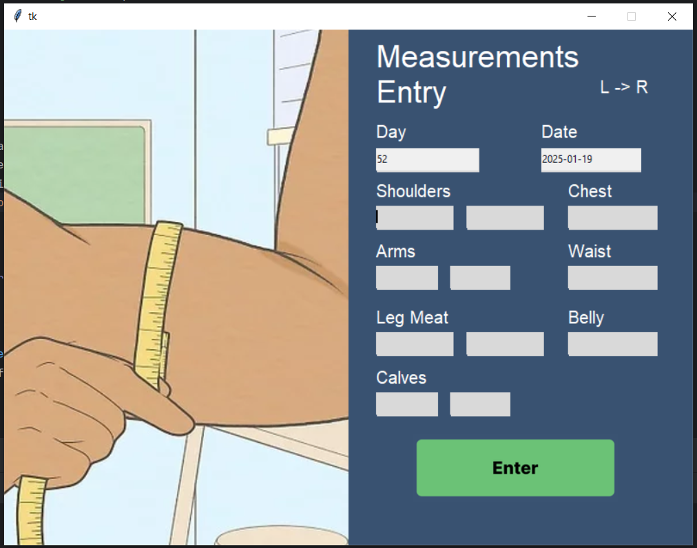

# Fitness Tracker with Data Analytics and Visualization 🏋️📊

Welcome to my **90-Day Fitness Tracker Project**! This project is designed to track and analyze personal fitness data over three months, providing actionable insights and visualizations to understand and improve your fitness journey.

---
## Bodyweight GUI


## Max Reps GUI


## Muscle Growth GUI



---

## 🚀 Features

### 📂 **Data Collection and Management**
- Log the following key metrics:
  - **Body Weight**: Track changes in overall weight.
  - **Max Reps for Exercises**: Monitor strength progress for key exercises (e.g., bench press, squats, deadlifts).
  - **Muscle Measurements**: Track growth in targeted muscle groups (e.g., arms, chest, legs).
- Organize and process data using **Pandas** for efficient management and analysis.

### 📊 **Data Analytics**
- Analyze trends and calculate key statistics, such as:
  - Weekly and monthly changes in body weight.
  - Improvements in max reps for exercises over time.
  - Growth rates for muscle measurements across different regions.
- Compare and correlate metrics to understand the effectiveness of your fitness plan.

### 📈 **Data Visualization**
- Generate insightful graphs and charts using Python's data visualization libraries:
  - **Line charts** for tracking body weight and strength progress.
  - **Bar graphs** for visualizing muscle measurement comparisons.
  - **Scatter plots** to explore relationships between metrics, such as muscle growth vs. strength improvements.
- Deliver clear visuals to help you identify patterns and trends.

### 🔍 **Insights and Reporting**
- Summarize findings such as:
  - Monthly improvements in max reps for key exercises.
  - Correlations between consistent body weight changes and muscle growth.
  - Highlighted areas for further focus or adjustment in your fitness plan.

---

## 🛠️ Tools and Technologies
- **Python**: Core programming language for the project.
- **Pandas**: For data cleaning, transformation, and analysis.
- Considering integrating a data analytics tool for advanced insights.

---

## 🌟 Getting Started
To explore or customize this project:

1. Clone the repository:
   ```bash
   git clone https://github.com/dylaan-codes/FitnessTracker.git
   
